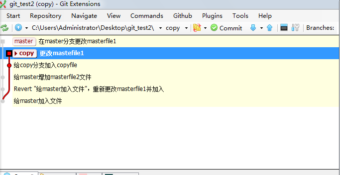

# git命令的测试和使用

## reset(soft mix hard)复位到哪个位置节点
- soft比mix模式更进一步，还将add记录了下来（也就是已经stage了之后直接commit就算完成了）

-mix   使用混合模式，使用reset复位到了某个commit，之前的commit都被删除了，但是以往commit的文件都被保存到原来的位置并没有动，也就是可以再次提交

-hard 如果使用hard，所有的commit也会消失，而且所有commit期间的文件也都消失了，所以之前历史的commit增加的文件无法再次提交了。

-->所以一个小总结：soft保存着你add的历史（也就是已经帮你stage过了），-mix还保存着你的文件，-hard连文件都给你删除了。

注意：不管你什么时候reset，没有add和commit的文件会在切换分支和resetcommit的过程中一直保持文件空悬着

## rebase && merge

就是将非当前分支重新档位base，这样就把自己提交的commit放到非当前分支修改的commit之前，并合并成一条线。这个方法可以消除merge对以后版本回退带来的困难。但是注意如果当前分支和非当前分支分别提交的commit中有对相同部分的内容的修改的话，就会无法rebase。如自己的截图

* merge 和rebase的使用
> https://www.zhihu.com/question/32163005/answer/76577586

## revert commit

其实际的含义就是对某个commit反悔了，可以修改后重新提交

## checkout ...branch

迁出到某个分支

* 注意点：

commit和commit && push之间的区别是什么？